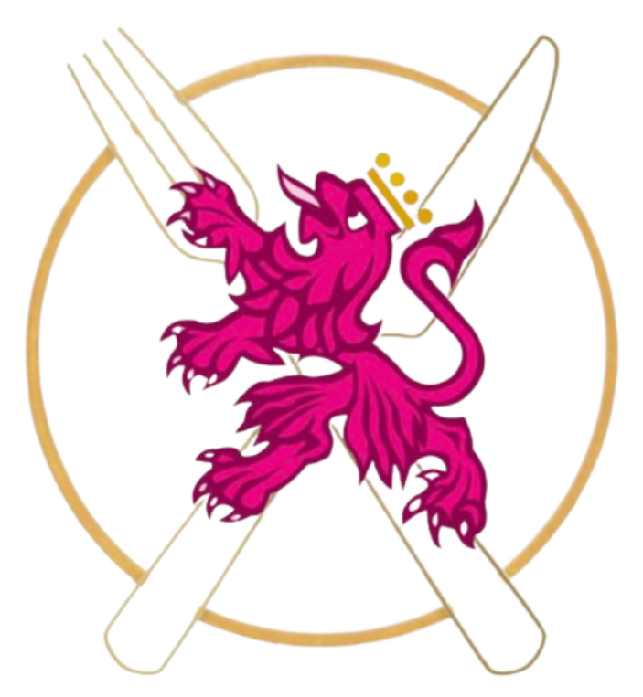

# MenULE

<p align="center">
  
</p>


-blueviolet)


**MenULE** es una aplicación de escritorio desarrollada como proyecto final de la asignatura Ingeniería del Software. Gestiona reservas, menús y pagos en un comedor universitario, facilitando el trabajo tanto a usuarios como al personal.

## Índice
- [Objetivos del proyecto](#objetivos-del-proyecto)
- [Roles y funcionalidades](#roles-y-funcionalidades)
- [Arquitectura del Proyecto](#arquitectura-del-proyecto)
- [Estructura del proyecto](#estructura-del-proyecto)
- [Detalle de funcionamiento](#detalle-de-funcionamiento)
- [Notificaciones y correos electrónicos](#notificaciones-y-correos-electrónicos)
- [Tecnologías utilizadas](#tecnologías-utilizadas)
- [Cómo ejecutar](#cómo-ejecutar)
- [Créditos](#créditos)
- [Ayuda interactiva](#ayuda-interactiva)


## Objetivos del proyecto
- Permitir la gestión de usuarios según roles: estudiante, profesor, visitante, personal de comedor, administrador.
- Facilitar la reserva de menús y pedidos diarios.
- Supervisar pagos, incidencias y estadísticas del servicio.
- Garantizar la trazabilidad de las reservas y los pagos realizados.
- Proveer interfaces diferenciadas por tipo de usuario.
- Mejorar la eficiencia en la gestión del stock de ingredientes y menús diarios.

## Roles y funcionalidades
| Rol               | Funcionalidades clave                          |Tipo de correo |
|------------------|-----------------------------------------------|------------------|
| Estudiante        | Reservar comida, historial, reportar errores, cargar saldo |*@estudiantes.unileon.es |
| Profesor          | Reservar comida, historial , reportar errores, cargar saldo |*@unileon.es|
| Visitante         | Hacer reservas rápidas sin cuenta         |*@gmail.com, *@hotmail.com |
| Personal Comedor  | Procesar pedidos, gestionar stock, añadir menus diarios           |*@comedor.unileon.es |
| Administrador     | Gestión de usuarios, menús, estadísticas    |*@menule.com |

**Notas:**
- Los **visitantes** no pueden recargar saldo: pagan cada menú en el acto.
- **Estudiantes** y **profesores** tienen descuentos en los menús, aunque el porcentaje de descuento es diferente para cada grupo.
- El sistema valida el tipo de correo en el registro para asignar el rol automáticamente.

## Arquitectura del Proyecto

MenULE sigue una arquitectura **MVC** (Modelo-Vista-Controlador) y utiliza los patrones **DAO** (Data Access Object) y **VO** (Value Object) para separar responsabilidades y facilitar el mantenimiento.

- **Modelo**: Lógica de negocio y acceso a datos.
    - [`src/modelo/dao/`](src/modelo/dao) — Clases DAO para acceso a la base de datos.
    - [`src/modelo/vo/`](src/modelo/vo) — Objetos de valor (VO) que representan entidades del dominio.
    - [`src/modelo/BussinessObject.py`](src/modelo/BussinessObject.py) — Clase central que coordina la lógica de negocio, gestionando la interacción entre los servicios del modelo y los controladores. Se encarga de orquestar operaciones complejas que involucran varias entidades y servicios.
    - [`src/modelo/conexion/Conexion.py`](src/modelo/conexion/Conexion.py) — Gestión de la conexión a la base de datos.

- **Vista**: Interfaces de usuario.
    - [`src/vista/`](src/vista) — Interfaces gráficas en Python y archivos `.ui` de Qt Designer.
    - Ejemplos: [`src/vista/personal_comedor/PanelComedor.py`](src/vista/personal_comedor/PanelComedor.py), [`src/vista/ui/PanelComedor.ui`](src/vista/ui/PanelComedor.ui)

- **Controlador**: Lógica de interacción entre la vista y el modelo.
    - [`src/controlador/`](src/controlador) — Controladores por rol y vista.
    - Ejemplo: [`src/controlador/ControladorComedor.py`](src/controlador/ControladorComedor.py)

---

## Estructura del proyecto

```
menule/
├── main.py                       # Punto de entrada principal de la aplicación
├── requirements.txt              # Dependencias del proyecto
├── README.md                     # Documentación principal
├── database/                     # Creación de la base de datos
│   ├──menule_squema.sql          # Crea la base de datos
│   └──*.py                       # variedad de archivos para insertar datos a las tablas
├── src/
│   ├── modelo/                   # Lógica de negocio y acceso a datos
│   │   ├── dao/                  # Clases DAO (acceso a base de datos)
│   │   ├── vo/                   # Objetos de valor (VO)
│   │   ├── conexion/             # Gestión de la conexión a la base de datos
│   │   ├── logica/               # logica de las operaciones
│   │   └── BussinessObject.py    # Lógica de negocio central
│   ├── vista/                    # Interfaces gráficas de usuario
│   │   ├── personal_comedor/
│   │   ├── estudiante/
│   │   ├── profesor/
│   │   ├── administrador/
│   │   ├── visitante/
│   │   ├── comun/
│   │   ├── ui/                   # Archivos .ui de Qt Designer
│   │   └── imagenes/ 
│   └── controlador/              # Controladores por rol y vista
│       ├──ControladorComedor.py
│       ├──ControladorEstudiante.py
│       └── ....
└── .env
└── .gitignore 
```

## Detalle de funcionamiento

- **main.py**: Punto de entrada de la aplicación. Inicializa la interfaz y gestiona el ciclo de vida.
- **Vistas**: Cada rol tiene su propia interfaz gráfica, por ejemplo:
    - Ejemplo: [`MenuAdmin.py`](src/vista/administrador/MenuAdmin.py) para administradores.
- **Controladores**: Cada vista tiene un controlador asociado que recibe eventos de la interfaz y llama a la lógica de negocio.
    - Ejemplo: [`ControladorComedor.py`](src/controlador/ControladorComedor.py)
- **Modelo**: El modelo contiene la lógica de negocio y el acceso a datos.
    - Los **DAO** (por ejemplo, [`IngredienteDao.py`](src/modelo/dao/IngredienteDao.py)) se encargan de las operaciones CRUD sobre la base de datos.
    - Los **VO** (por ejemplo, [`IngredienteVo.py`](src/modelo/vo/IngredienteVo.py)) representan entidades como ingredientes, menús, usuarios, etc.
    - [`BussinessObject.py`](src/modelo/BussinessObject.py) centraliza la lógica de negocio y coordina los servicios.

---

## Notificaciones y correos electrónicos

La aplicación MenULE envía correos electrónicos automáticos en distintas situaciones, como por ejemplo:

- Confirmación de reservas de menú.
- Notificación de incidencias reportadas.
- Avisos administrativos o de gestión de usuarios.

El envío de correos se realiza utilizando la api de [`sendgrid`](https://pypi.org/project/sendgrid/).  
Los correos se envían a la dirección registrada por el usuario según su rol y acción realizada en la aplicación.

> **Nota:** Para que el envío de correos funcione correctamente, es necesario configurar las credenciales del servicio de correo en el archivo `.env` del proyecto (clave api).


## Tecnologías utilizadas
- Python 3.x
- PyQt5
- MySQL
- MVC + DAO + VO como patrón de arquitectura

## Cómo ejecutar
1. Clona el repositorio:
```bash
git clone https://github.com/jaimecarfe/menule
```
2. Genera la base de datos:
   - Abre un gestor de MySQL o una terminal y ejecuta el script [`database/menule_squema.sql`](database/menule_squema.sql) para crear la base de datos y sus tablas:
   ```bash
   mysql -u TU_USUARIO -p < database/menule_squema.sql
   ```
> [!TIP]
>    - Si tienes scripts de datos puedes ejecutarlos para comprobar que funciona todo de forma correcta a la hora de testear la aplicación.  
    En la carpeta [`database`](database/) tienes disponibles un par de scripts Python usados durante el desarrollo que puedes ejecutar para insertar datos de ejemplo en las tablas.
>

3. Configura la conexión a la base de datos:
   - Abre [`src/modelo/conexion/Conexion.py`](src/modelo/conexion/Conexion.py).
   - Modifica los valores de `user`, `password`, `host` y `database` según tu configuración de MySQL:
     ```python
     def __new__(cls, host='localhost', database='menule', user='TU_USUARIO', password='TU_CONTRASEÑA'):
     ```
> [!NOTE]
> 
>   - Si tu MySQL utiliza un **puerto diferente** al que viene por defecto (3306), modifícalo en la línea de la cadena de conexión (línea 22 del archivo):
>     ```python
>     f"jdbc:mysql://{self._host}:TUPUERTO/{self._database}",
>     ```
>


4. Instala las dependencias necesarias:
```bash
pip install -r requirements.txt
```
5. Ejecuta la aplicación:
```bash
python main.py
```

6. Crear los usuarios:
   - Puedes crear usuarios (estudiantes, profesores, visitantes y personal de comedor) desde la propia aplicación, utilizando la interfaz de registro.
   - El usuario administrador debe ser creado directamente en la base de datos, ya que no existe opción de registro para este rol desde la aplicación. Puedes hacerlo insertando un registro manualmente en la tabla de usuarios con el correo correspondiente (por ejemplo, *@menule.com) y los permisos adecuados.


## Créditos
Proyecto desarrollado por el equipo de Ingeniería del Software (2º año) - Curso 2024/2025.

Alumnos:
- Mario Fernández Costello
- Juan Miguel Pinos Seco
- Jaime Carnicero Fernández
- Yago García-Argüelles Díaz


## Ayuda interactiva
En caso de querer profundizar en el funcionamiento técnico de nuestro proyecto de forma visual e interactiva le remitimos a una herramienta que puede serle de ayuda:
[](https://deepwiki.com/jaimecarfe/menule)